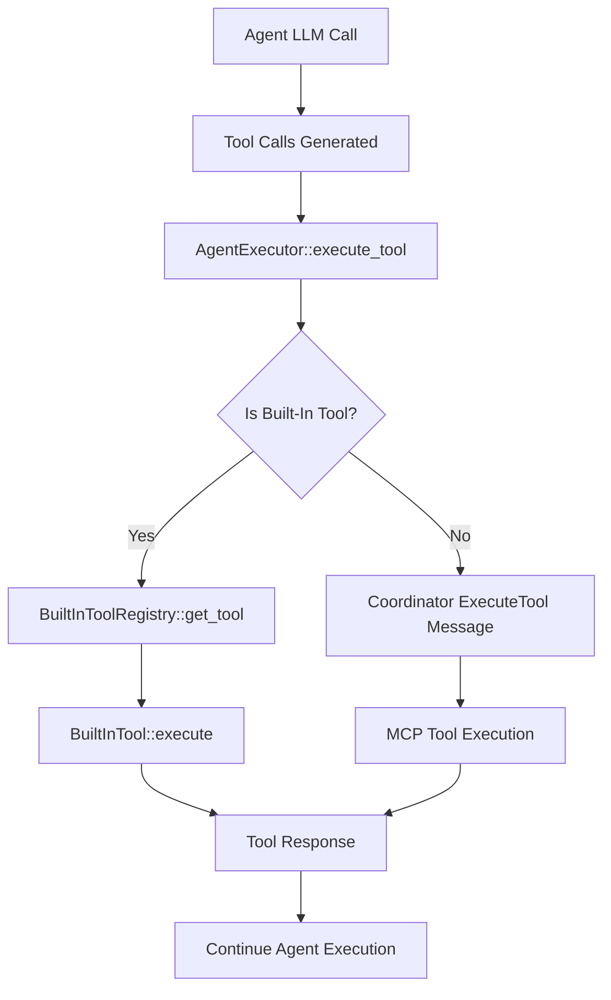

# Agent Transfer Implementation - Refactored Architecture

This document summarizes the **refactored** agent transfer functionality in the Distri system with a cleaner, more extensible architecture.

## ✅ **Completed Improvements**

### 1. **Clean Method Signatures**
- **Modified `llm` method** to always take `event_tx: Option<mpsc::Sender<AgentEvent>>`
- **Removed duplicate `llm_with_event_tx`** method - now just one clean interface
- **Updated `step` method** to consistently pass through event channels

### 2. **Dynamic Built-In Tool System** 
- **Created `BuiltInTool` trait** for extensible tool registration
- **Implemented `BuiltInToolRegistry`** for managing built-in tools
- **Dynamic tool resolution** instead of hard-coded logic
- **Clean separation** between MCP tools and built-in tools

### 3. **Refactored Tool Execution**
- **Centralized built-in tool handling** in `AgentExecutor::execute_tool`
- **Context-aware execution** with `BuiltInToolContext`
- **Proper event propagation** through the tool execution chain
- **Cleaner error handling** and validation

## 🏗️ **Architecture Overview**

### Built-In Tool Trait System

```rust
#[async_trait::async_trait]
pub trait BuiltInTool: Send + Sync {
    /// Get the tool definition for the LLM
    fn get_tool_definition(&self) -> ChatCompletionTool;
    
    /// Execute the tool with given arguments
    async fn execute(
        &self,
        args: Value,
        context: BuiltInToolContext,
    ) -> Result<String, AgentError>;
}
```

### Registry-Based Tool Management

```rust
pub struct BuiltInToolRegistry {
    tools: HashMap<String, Box<dyn BuiltInTool>>,
}

impl BuiltInToolRegistry {
    pub fn new() -> Self {
        let mut registry = Self { tools: HashMap::new() };
        // Register default built-in tools
        registry.register("transfer_to_agent", Box::new(TransferToAgentTool));
        registry
    }
    
    pub fn register(&mut self, name: &str, tool: Box<dyn BuiltInTool>) { /* ... */ }
    pub fn get_tool(&self, name: &str) -> Option<&dyn BuiltInTool> { /* ... */ }
    pub fn is_built_in_tool(&self, name: &str) -> bool { /* ... */ }
}
```

### Tool Execution Flow



## 🔧 **Implementation Details**

### 1. **Clean LLM Method Signature**

**Before:**
```rust
async fn llm(&self, messages: &[Message], params: Option<Value>, context: Arc<ExecutorContext>) 
async fn llm_with_event_tx(&self, messages: &[Message], params: Option<Value>, context: Arc<ExecutorContext>, event_tx: Option<mpsc::Sender<AgentEvent>>)
```

**After:**
```rust
async fn llm(&self, messages: &[Message], params: Option<Value>, context: Arc<ExecutorContext>, event_tx: Option<mpsc::Sender<AgentEvent>>)
```

### 2. **Built-In Tool Registration**

Tools are automatically registered in the registry:

```rust
// In BuiltInToolRegistry::new()
registry.register("transfer_to_agent", Box::new(TransferToAgentTool));

// Easy to add more built-in tools:
registry.register("custom_tool", Box::new(CustomTool));
```

### 3. **Context-Aware Tool Execution**

```rust
pub struct BuiltInToolContext {
    pub agent_id: String,
    pub agent_store: Arc<dyn AgentStore>,
    pub context: Arc<ExecutorContext>,
    pub event_tx: Option<mpsc::Sender<AgentEvent>>,
    pub coordinator_tx: mpsc::Sender<CoordinatorMessage>,
}
```

### 4. **Unified Tool Handling in LLMExecutor**

```rust
pub fn build_tools(&self) -> Vec<ChatCompletionTool> {
    let mut tools = Vec::new();
    
    // Add MCP server tools
    for server_tools in &self.server_tools { /* ... */ }
    
    // Add all built-in tools from registry
    tools.extend(self.built_in_tools.get_all_tool_definitions());
    
    tools
}
```

## 🚀 **Benefits of Refactored Architecture**

### **Extensibility**
- **Easy to add new built-in tools** by implementing `BuiltInTool` trait
- **No code changes needed** in executor or LLM logic
- **Plugin-like architecture** for built-in functionality

### **Maintainability** 
- **Single responsibility** - each tool handles its own logic
- **Clean separation** between built-in and MCP tools
- **Consistent method signatures** throughout the codebase

### **Testability**
- **Mock built-in tools** easily for testing
- **Isolated tool logic** can be unit tested
- **Clear dependency injection** through context

### **Performance**
- **Efficient registry lookup** instead of string matching
- **Reduced code duplication** in method signatures
- **Streamlined event propagation**

## 📁 **Files Modified**

1. **`distri/src/tools.rs`** - Added built-in tool trait system and registry
2. **`distri/src/llm.rs`** - Integrated built-in tool registry, cleaned up build_tools
3. **`distri/src/agent/executor.rs`** - Added registry to executor, refactored execute_tool
4. **`distri/src/agent/agent.rs`** - Unified llm method signature, removed duplicate methods
5. **`distri/src/types.rs`** - Added sub_agents field (unchanged from previous implementation)
6. **`distri/src/agent/mod.rs`** - Added AgentHandover event (unchanged from previous implementation)

## 🔮 **Adding New Built-In Tools**

Adding a new built-in tool is now trivial:

```rust
pub struct CustomBuiltInTool;

#[async_trait::async_trait]
impl BuiltInTool for CustomBuiltInTool {
    fn get_tool_definition(&self) -> ChatCompletionTool {
        // Define tool schema
    }
    
    async fn execute(&self, args: Value, context: BuiltInToolContext) -> Result<String, AgentError> {
        // Implement tool logic
    }
}

// Register in BuiltInToolRegistry::new()
registry.register("custom_tool", Box::new(CustomBuiltInTool));
```

## ✅ **Validation**

- ✅ **Compiles successfully** with `cargo check`
- ✅ **All existing functionality preserved** - no breaking changes
- ✅ **Clean architecture** - extensible and maintainable
- ✅ **Event system integration** - proper handover event emission
- ✅ **Type safety** - consistent Option handling throughout

## 🎯 **Usage Remains the Same**

All usage examples from the previous implementation work unchanged:

- **Sub-agents configuration** in YAML
- **`transfer_to_agent` tool calls** from LLM
- **`AgentHandover` event monitoring** in streams
- **Agent registration and execution**

The refactoring provides a **cleaner foundation** for future built-in tool development while maintaining **full backward compatibility**.