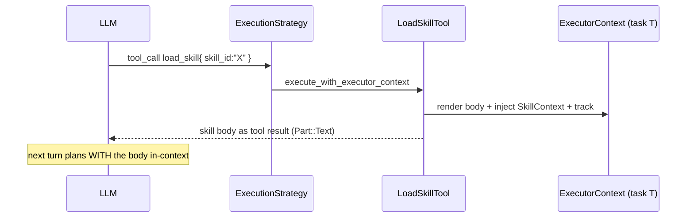
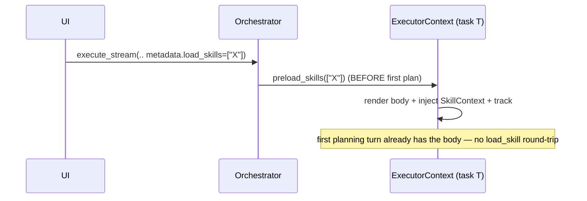
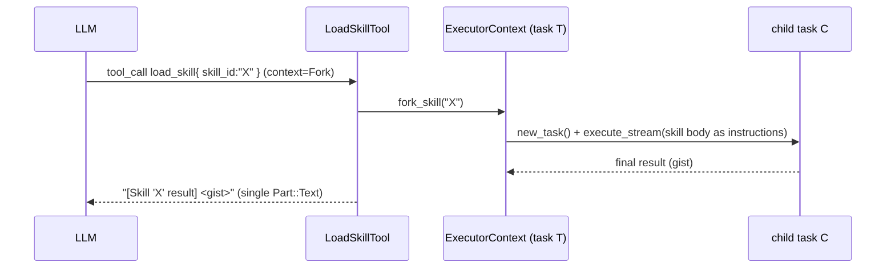
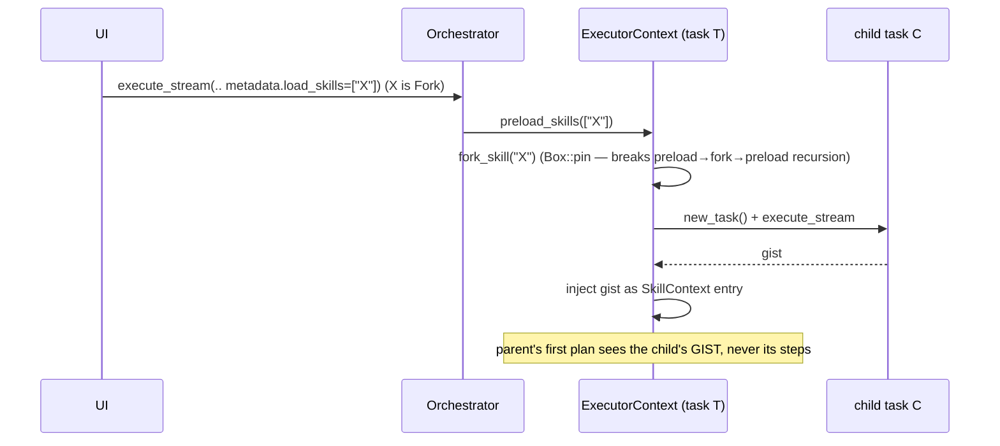

# Execution flow — agent loop, skills, forks & sub-tasks

How a message becomes work in distri-core: the layers it passes through, what a
**skill** does (and the crucial `Inline` vs `Fork` split), how a **sub-task**
is spawned, and how every one of those paths surfaces in the chat UI.

> Companion to `agent-fork-parallelization.md` (the fork/parallel/early-stop
> feature work). This doc is the *map*; that one is the *changelog*.

---

## 1. The layers

```
┌──────────────────────────────────────────────────────────────────────┐
│ AgentOrchestrator            composition root: registry + runner + CRUD│
│  • register_agent_definition / register_tool / register_mcp_server     │
│  • create_thread / get_thread / …            (thread CRUD)             │
│  • execute_stream → call_agent_stream         (RUNNER: drives a task)  │
│  • complete_tool / call_tool_with_context     (external-tool glue)     │
│  • invoke()  ── invoke.rs ──                  (SUB-AGENT DISPATCH)     │
└───────────────┬──────────────────────────────────────────────────────┘
                │ builds + drives
                ▼
┌──────────────────────────────────────────────────────────────────────┐
│ AgentLoop.run()                 the turn loop (agent_loop.rs)          │
│   repeat until final / max_iterations / should_continue == false:     │
│     PlanningStrategy.plan()      → AgentPlan { steps: [PlanStep] }     │
│     ExecutionStrategy.execute_step(step)                              │
│     ExecutionStrategy.should_continue()                               │
└───────────────┬───────────────────────────────────┬──────────────────┘
                │ uses                               │ uses
                ▼                                    ▼
┌─────────────────────────────┐      ┌──────────────────────────────────┐
│ PlanningStrategy            │      │ ExecutionStrategy (AgentExecutor) │
│  unified.rs (LLM → steps)   │      │  execution/default.rs             │
│  • group_tool_calls_into_   │      │  • handle_tool_calls              │
│    steps  → ONE step/round  │      │  • execute_tool_calls_with_timeout│
│                             │      │    (join_all + concurrency gate)  │
│                             │      │  • should_continue (early-stop)   │
└─────────────────────────────┘      └──────────────────────────────────┘

         carried through every call, NEVER the driver:
┌──────────────────────────────────────────────────────────────────────┐
│ ExecutorContext (context.rs)        per-task STATE bag                 │
│  ids: thread_id / task_id / run_id / agent_id / parent_task_id        │
│  state: status · final_result · usage · scratchpad · tools · skills   │
│  output: event_tx (→ chat stream) · parent_tx (→ parent)              │
└──────────────────────────────────────────────────────────────────────┘
```

**Design rule (aspirational, see §8):** `ExecutorContext` is *state passed in*,
mirroring A2A's `RequestContext`, OpenAI's `RunContextWrapper`, LangGraph's
`State`. The **runner** owns the loop and all spawning. Anything that *starts a
new task* is a dispatch concern, not a state-object method.

---

## 2. The happy path (no skills, no forks)

```mermaid
sequenceDiagram
    participant UI
    participant Orch as AgentOrchestrator
    participant Loop as AgentLoop
    participant Plan as PlanningStrategy
    participant Exec as ExecutionStrategy
    participant Ctx as ExecutorContext

    UI->>Orch: execute_stream(agent, message, ctx)
    Orch->>Orch: ensure thread + task rows
    Orch->>Loop: run(ctx)
    loop until final / max_iter / stop
        Loop->>Plan: plan(ctx)
        Plan-->>Loop: AgentPlan { steps }
        Loop->>Exec: execute_step(step, ctx)
        Exec->>Ctx: store_execution_result(...)
        Exec-->>Loop: ExecutionResult
        Loop->>Exec: should_continue(ctx)
        Exec-->>Loop: true / false
    end
    Loop-->>Orch: InvokeResult
    Orch-->>UI: events streamed via ctx.event_tx
```

---

## 3. Skills — the `Inline` vs `Fork` split

A **skill** is a markdown body (a reusable instruction block / mini-playbook)
stored in the `skill_store`. Each skill declares a `ContextExecutionType`:

| `context` | Meaning | Where its body runs | Parent context impact |
|---|---|---|---|
| **`Inline`** | "Read this and keep going." | The **current** task's own loop | Body is injected into the parent's scratchpad; parent's tokens grow |
| **`Fork`**   | "Hand this off to a fresh worker." | A **new child task** (isolated) | Only the child's *gist* (final result) comes back |

Two independent axes decide *when* and *how* a skill loads:

```
            WHO triggers the load?                 WHAT does the skill declare?
  ┌─────────────────────────────┐          ┌──────────────────────────────────┐
  │ (a) LLM calls load_skill     │          │  context = Inline                 │
  │     mid-loop  (reactive)     │   ×      │      → inject body, same task     │
  │ (b) metadata.load_skills      │          │  context = Fork                   │
  │     preloaded at startup     │          │      → spawn child task, gist back│
  │     (proactive, no round-trip)│          │                                   │
  └─────────────────────────────┘          └──────────────────────────────────┘
```

That's a 2×2. All four cells are real and documented below.

### 3a. `Inline` skill — what actually happens

```
            ExecutorContext (task T)
            ┌───────────────────────────────────────────┐
 load       │ scratchpad:                               │
 skill  ──► │   … prior steps …                         │
 "X"        │   + SkillContext{ id:"X", body:"<render>"}│  ← injected here
            │ skill_tracker.track("X")  (for reinjection│
            │                            after compaction)│
            └───────────────────────────────────────────┘
            Same task_id, same loop, same token budget.
            Next planning turn SEES the skill body in-context.
```

- Body is rendered through the **same** `render_prompt` pipeline as the system
  prompt (so `{{> partials}}` / `{{runtime_mode}}` resolve identically).
- Tracked in `skill_tracker` so it survives compaction (`reinject_skills`).
- **Cost:** grows the parent context. **Benefit:** the agent can immediately act
  on the instructions in its current turn.

### 3b. `Fork` skill — what actually happens

```
   parent task T                         child task C  (new_task)
   ┌──────────────────┐   fork_skill     ┌──────────────────────────┐
   │ thread_id  = TH  │  ───────────────►│ thread_id  = TH  (same)  │
   │ task_id    = T   │                  │ task_id    = C   (fresh) │
   │ run_id     = r1  │                  │ run_id     = r2  (fresh) │
   │ event_tx   ──────┼───── shared ─────┤ event_tx   = (inherited) │ ← child
   │                  │                  │ parent_task_id = T       │   events
   │                  │◄──── gist ───────┤ instructions = skill body│   stream
   │  scratchpad gets │  "[Skill X       │ fresh scratchpad + budget│   to the
   │  ONE gist entry  │   result] …"     │ runs its OWN loop        │   SAME chat
   └──────────────────┘                  └──────────────────────────┘
            "one brief in, one gist out"  (Anthropic multi-agent contract)
```

- `new_task` clones identity/stores but mints a **fresh** `task_id`/`run_id`,
  sets `parent_task_id = T`, and **inherits `event_tx`** — so the child's events
  stream into the *same* chat, tagged with its own `task_id` + `parent_task_id`.
- The child runs a **complete, independent** agent loop (its own planning,
  tools, budget). The parent is blocked until it finishes (synchronous fork).
- Only the child's **final result** is folded back into the parent as a single
  `[Skill 'X' result] …` entry. The parent never sees the child's internal steps.
- **Cost:** a full sub-run. **Benefit:** parent context stays clean; the heavy
  work is isolated.

---

## 4. All scenarios (the 2×2 + sub-agents)

### S1 — `Inline` skill, LLM-triggered (`load_skill` tool, mid-loop)



### S2 — `Inline` skill, metadata-triggered (`preload_skills`, at startup)



### S3 — `Fork` skill, LLM-triggered (`load_skill` tool, mid-loop)



### S4 — `Fork` skill, metadata-triggered (`preload_skills`, at startup)



> This is the **activity-editor path**: the frontend names a `Fork`-type skill in
> `metadata.load_skills`; the editor's sub-task runs in isolation and the parent
> thread shows it as a collapsible child with a one-line gist.

### S5 — Sub-agent via `invoke()` (the typed dispatch path)

The general dispatch primitive (`invoke.rs`). A skill-fork is conceptually a
special case of this (see §8).

```
Invocation {
  targets: [ Target { agent: Named|AdHoc, message } , … ],
  context: Independent | Inherited | Shared,     // what the child sees first
  join:    Single | All | Detached,              // how the parent waits
  tools:   Inherit | … ,                          // child's tool pool
}
```

| `join` | Parent waits? | Returns | Use |
|---|---|---|---|
| **Single** | yes, one target | scalar gist | "go do X, tell me the answer" |
| **All** | yes, all targets | `Vec<gist>` (input order) | fan-out + join |
| **Detached** | no | `Vec<task_id>` immediately | fire-and-forget; manage via `get_task`/`wait_task`/`cancel_task` |

| `context` | Child's first-turn view |
|---|---|
| **Independent** | fresh task, empty history (one-shot workers) |
| **Inherited** | fresh task + copy of parent's messages (*"default for run_skill"*) |
| **Shared** | SAME task — hard handover; parent's loop ends, child's result becomes parent's |

---

## 5. Early-stop on a tool call (`should_continue`)

A tool ends the **turn** the instant its result is back — no extra LLM
round-trip — by emitting a `Part::Data` with `{ "should_continue": false }`.

```
execute_step → store tool result (… + Part::Data{should_continue:false})
                              │
should_continue(ctx):         ▼
   final_result set?  ──► false (stop)
   status != Running? ──► false (stop)
   last result has Part::Data{should_continue:false}? ──► false (STOP)   ← here
   else                ──► true (loop again)
```

- Frontend: a tool with `stopAfterTurn` appends that part via
  `createSuccessfulToolResult`. zippy's `publish_content` appends it **on
  success only** (a failed publish keeps the turn open to retry).
- Distinct from `is_final` (the LLM-side terminal-tool flag, e.g. `final` /
  `reflect`). `should_continue:false` is **tool-result-driven**; `is_final` is
  **tool-identity-driven**.

---

## 6. Parallel tools in one turn

The LLM can return several `tool_use` blocks at once. They are collected into
**one** `Action::ToolCalls` step (`group_tool_calls_into_steps`) and executed
together:

```
ToolCalls{ [a, b, c] }
   │  execute_tool_calls_with_timeout
   ▼
 join_all([a, b, c])  gated by a Semaphore:
   all concurrency_safe?  → max_parallel = N   (true parallel)
   any NOT safe?          → max_parallel = 1   (serialize the batch — writes can't race)
results mapped back by tool_call_id (order never affects correctness)
```

---

## 7. How every child surfaces in chat

All paths above ultimately stream through `ctx.event_tx`, and every event
carries `task_id` **and** `parent_task_id`:

```
event { task_id: C, parent_task_id: T, … }
        │
        ▼  (distrijs chatStateStore reducer)
   tasks: Map<id, TaskState{ parentTaskId, childTaskIds[] }>
        │
        ▼  (SubTaskCard / SubTaskTree)
   ▸ subtask C   [✓]  3 subtasks   "…final gist…"     ← collapsed: count + gist
   ▾ subtask C   [⟳]  running…                         ← auto-expand while running/failed
       └─ nested steps, tool calls, grandchildren
```

- **Inline** skills produce **no** child task — they're steps inside the parent.
- **Fork** skills and `invoke()` targets produce child tasks → collapsible cards.
- Collapsed card shows descendant count + the child's one-line gist; auto-expands
  while running or on failure.

---

## 8. Architecture note — where `fork_skill` *should* live

Today `fork_skill` lives on `ExecutorContext` (`context.rs`). That's a **state
object spawning a task** — the one thing every comparable system keeps out of
the context object:

- **A2A** — a sub-agent call is the agent acting as a *client*; `RequestContext`
  never spawns.
- **OpenAI Agents SDK** — `Runner` owns spawning; `RunContextWrapper` is data.
- **LangGraph** — subgraphs are *nodes*; `State` is data.

There are also **two parallel fork mechanisms**: the typed `invoke.rs`
(`Invocation`) and the ad-hoc `fork_skill` → `execute_stream`. They duplicate the
same lineage + gist logic. And the `Invocation` model *already anticipated
skills* — `ContextScope::Inherited` is documented as *"default for `run_skill`"*.

**Target state:**

```
  context.rs       state only (no spawning)
  invoke.rs        the single dispatch home — Invocation → child task
  fork (skill)     builds an Invocation { Target{ Named(self)+overlay }, Single }
                   and calls invoke()   ← unifies the two paths
```

The one gap to close first: `Target`/`AgentRef` can't yet express *"the same
named agent, plus this skill body as an instruction overlay"* — `AgentRef::Named`
has no overlay and `AgentRef::AdHoc` drops the base agent's own prompt/tools.
A small `AgentRef::Named { agent_id, instructions_overlay: Option<String> }`
addition lets a skill-fork become a one-line `invoke()`, after which
`fork_skill` deletes itself.

`preload_skills` itself stays in context — resolving + injecting an `Inline`
body genuinely mutates *this* task's state. Only its **Fork branch** should
delegate to the dispatch layer instead of spawning directly.
